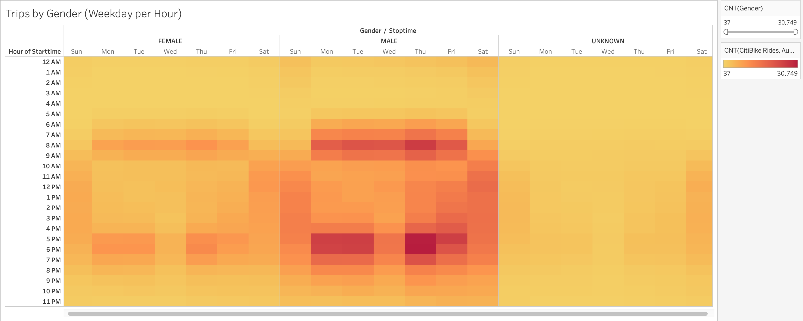

# Bikesharing
Creating a bikesharing app with Tableau 

## Overview
CitiBike is a popular bike sharing app in New York City. Users can download the app to check out a bike anywhere in the city. When the user is done with the ride, they simply lock the bike up and are charged for the duration of the trip. This service has become increasingly popular in urban areas where vehicle transportation or parking may be difficult or expensive. The goal of this project is to use Tableau to analyze CitiBike ridership data from August 2019 to develop a similar bike sharing service in Des Moines, Iowa. 

**Link to Tableau Analysis:** [CitiBike Dashboard](https://public.tableau.com/profile/jessica.johnson7779#!/vizhome/CitiBike_Challenge_16144155819860/NYCCitiBikeStory?publish=yes)

## Results

#### *Checkout Times for Users*
Nearly all bikes are checked out for less than an hour at a time, with most rides lasting about 5 minutes.

#### *Checkout Times by Gender*
A majority of bikes are checked out by male riders. 

#### *Trips by Weekday for Each Hour*
Rides tend to increase during weekday commuting hours (6am-9am and 4pm-7pm), and midday during weekends.

#### *Trips by Gender (Weekday per Hour)*
Male and female riders share similar trends when checking out bikes based on day/time. Unknown may not have enough data to identify trends.

#### *Trips by Gender by Weekday*
Male subscribers represent the greatest rider demographic regardless of the day of the week.

#### *Top Starting Locations*
Most bikes are checked out in the Manhattan area.

#### *Average Trip Duration*
In general, younger riders tend to check out bikes for longer rides.

#### *August Peak Hours*
Confirmation that peak riding hours are between 6am-9am, and 4pm-7pm. The fewest bikes are checked out between 2am-5am.

#### *Bike Utilization*
Each circle corresponds to an individual BikeID. Cirlce size is positively correlated with the length of time the bike has been checked out for. This can be used to identify which bikes are in need of service or repair. 

## Summary
The CitiBike data from New York will be extremely helpful in forming a similar bike service in Des Moines. From thes analyses we've found that a majority of users are male, and that most of these riders are annual subscribers. Additionally, we've found that peak riding hours are typically during workweek commuting hours, and midday during the weekends when riders are more likely to be riding for leasure. Though the map will look different for Des Moines, we can see from the map of starting locations, that most bikes are checked out in more highly populated areas like downtown or near tourist attractions. 

Based on these findings, the bike app for Des Moines should focus on marketing to male riders and offering incentives for subscription. We can also reccomend placing more bikes and docking stations near downtown areas, office buildings, and tourist attractions since CitiBike in New York appears to be used primarily for commuting and/or sightseeing. 

Additional analyses that would be especially infomrative for transitioning to a Des Moins include the following:

1. A comparison of the number of trips bewteen different months to understand how ridership changes seasonally. The temperature in Des Moines can drop to the low teens in winter months and ice buildup on the roads may discourage ridership, unless bikes have special accomodations. 

2. Trips by weekday by age group - This would help the Des Moines team better understand their target audience for marketing the new app.

3. A measurment of the number of bikes checked out per station, and also the number of bikes checked in to each station. This will help the Des Moines team plan where to put stations in their town based on the flow of bike traffic. 

